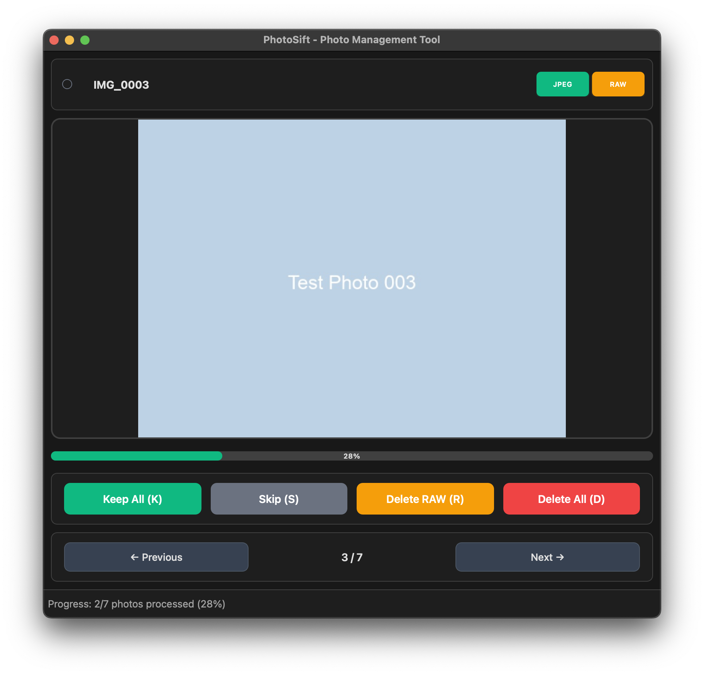

# PhotoSift - Photo Management Tool


A fast and lightweight photo culling application for Canon DSLR files, designed to help photographers quickly sort through their photos and decide which files to keep, delete, or process further.

## Motivation

Most existing photo management solutions feel overcomplicated for the simple task of culling photos after a shoot. They often require importing photos into catalogs, navigating complex interfaces, or switching between multiple tools. PhotoSift was created to solve this specific workflow pain point with a single-purpose, lightning-fast application that lets you:

- **Skip the import process** - Work directly with your files without catalog overhead
- **Make decisions quickly** - Simple keyboard shortcuts and immediate visual feedback
- **Stay focused** - No distracting features, just the essentials for photo culling
- **Work efficiently** - Smart confirmation system with undo capabilities for safety without friction

PhotoSift is for photographers who want to get through the initial culling process as quickly as possible and move on to the creative work that matters.

## Screenshot



*PhotoSift's clean, keyboard-driven interface designed for fast photo culling*

## Quick Start

```bash
# Clone and install
git clone https://github.com/YOUR_USERNAME/photosift.git
cd photosift
pip install -r requirements.txt

# Run PhotoSift
python main.py
```

Open a folder (`Ctrl+O`) and start culling with keyboard shortcuts:
- `K` - Keep all files
- `R` - Delete RAW, keep JPEG
- `D` - Delete all files
- `S` - Skip this photo

## Documentation

- 📋 [Features](docs/features.md) - Complete feature list and capabilities
- 🚀 [Getting Started](docs/getting-started.md) - Detailed installation and setup
- ⚡ [Workflow](docs/workflow.md) - Optimized culling workflow and smart confirmation system
- 🔧 [Architecture](docs/architecture.md) - Technical details and project structure
- 🤝 [Contributing](docs/contributing.md) - How to contribute to PhotoSift

## License

GNU General Public License v3.0 - See LICENSE file for details

---

*Built by photographers, for photographers. Happy culling! 📸*
